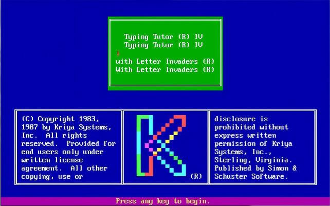

<p align="center">
  <a href="README.md"></a>&nbsp;
  <a href="README.zh-CN.md"></a>
</p>

# MS-DOS 经典收藏集 🖥️

> 保存个人计算的基础——MS-DOS 环境、工具、启动盘和历史资源。

[](LICENSE)
[]()
[]()
[]()
[]()
[]()

---

## 📋 概述

本仓库是一个精心整理的 **MS-DOS 资源合集**，包括：

- **MS-DOS 6.22** — Ghost 磁盘镜像和启动盘
- **MS-DOS 7.10** — 最终版 DOS（来自 Windows 98 SE）
- **启动盘镜像** — DOS 救援盘、Windows 9x 启动盘及实用工具
- **虚拟机镜像** — 预配置的 [QEMU](ms-dos-in-qemu/README.md) 和 [VMware](ms-dos-in-vmware/README.md) 虚拟机
- **MS-DOS 6.0 源代码** — 供历史和教育参考
- **经典 Windows** — Windows 1.0 和中文 PWIN 3.2 安装盘

---

## 📦 仓库结构

```
msdos/
├── README.md                              # 本文件（英文版）
├── ms-dos-622.gho                         # MS-DOS 6.22 Ghost 系统镜像
├── Ghost60.exe                            # Norton Ghost 6.0（磁盘克隆工具）
│
├── boot-disk/                             # 启动盘镜像合集
│   ├── README.md                          #   说明文档
│   ├── ms-dos-622.img                     #   MS-DOS 6.22 启动盘
│   ├── ms-dos-rescue.img                  #   DOS 救援盘
│   ├── win95.img                          #   Windows 95 启动盘
│   ├── win98se.img                        #   Windows 98 SE 启动盘
│   ├── hd-copy.exe                        #   HD-COPY v2.3R — 软盘复制/映像工具
│   ├── undisk.exe                         #   磁盘镜像提取工具
│   └── undiskp.exe                        #   UNDISK（保护模式）
│
├── tools/                                 # DOS 实用工具
│   ├── ARJ.EXE                            #   ARJ v2.50 归档工具
│   ├── pkzip250.exe                       #   PKZIP v2.50 压缩工具
│   ├── pct9.zip                           #   PC Tools 9.0 工具套件
│   ├── sea13.zip                          #   Sea v1.3 图像查看器
│   ├── TT/                                #   Typing Tutor IV — 打字教学程序
│   └── README.md                          #   说明文档
│
├── games/                                 # 经典 DOS 游戏
│   ├── doom.zip                           #   DOOM（1993, id Software）
│   ├── Command & Conquer.zip              #   命令与征服（1995, Westwood Studios）
│   └── README.md                          #   说明文档
│
├── ms-dos-7.10/                           # MS-DOS 7.1（最终版 DOS）
│   ├── ms-dos-71-disk1.zip                #   安装盘 1
│   ├── ms-dos-71-disk2.zip                #   安装盘 2
│   └── ms-dos-71-boot.zip                 #   启动盘
│
├── ms-dos-in-qemu/                        # QEMU 1.2 中的 MS-DOS 6.22
│   ├── README.md                          #   安装指南
│   ├── myimage.zip                        #   预构建的 QEMU 磁盘镜像
│   └── qemu-screenshot.png                #   截图
│
├── ms-dos-in-vmware/                      # VMware 5.5 中的 MS-DOS 6.22
│   ├── README.md                          #   安装指南
│   └── ms-dos-vmware-5.5.zip              #   预构建的 VMware 虚拟机
│
├── ms-dos-6.0-source-code.zip             # MS-DOS 6.0 源代码（教育用途）
├── chinese-windows-3.2-setup-disk.zip     # PWIN 3.2（中文 Windows 3.2）
├── windows-1.0-setup-disk.zip             # Windows 1.0 安装盘
├── web-demo/                                # 在线 DOS 演示（js-dos）
│   ├── index.html                          #   Typing Tutor IV 浏览器版
│   └── tt-bundle.jsdos                     #   js-dos 程序包
├── UCDOS-7.0-WPS-CCED-6.0-setup.iso      # UCDOS 7.0（含 WPS）+ CCED 6.0
│
├── c and c++/                              # C/C++ 开发工具
│   ├── README.md                          #   说明文档
│   ├── Turbo C 2.01 (5.25-360k).zip       #   Turbo C 2.01 — 合并自 6 张软盘镜像
│   └── Turbo C++ 3.0.zip                  #   Turbo C++ 3.0 — 完整包
```

---

## 🚀 快速开始

### 方式一：DOSBox（跨平台，推荐）🎯

**一键启动** — 安装 [DOSBox](https://www.dosbox.com/) 后，在仓库根目录运行：

```bash
dosbox -conf dosbox.conf
```

这将自动挂载仓库目录、配置 PATH 路径，并预设好内存（EMS/XMS）、声卡（Sound Blaster 16）和 VGA（SVGA S3），无需任何手动配置。

**进入 DOSBox 后**，你位于仓库根目录 `C:\`。以下是一个操作示例：

```dos
C:\> dir              → 查看当前目录文件
C:\> cd tools\TT      → 进入 Typing Tutor IV 目录
C:\TOOLS\TT> TT       → 启动打字教学程序
C:\> cd games         → 浏览经典 DOS 游戏
C:\> cd assembly      → 汇编开发工具目录
```

任何时候输入 `EXIT` 即可退出 DOSBox。

> 
> *Typing Tutor IV — 本仓库收录的经典 DOS 打字教学程序。*

> **▶️ [在浏览器中运行](web-demo/index.html)** — 通过 [js-dos](https://js-dos.com/) 在线体验 Typing Tutor IV（本地打开 `web-demo/index.html`，或 `npx serve web-demo` 启动服务）。

---

### 方式二：QEMU（轻量级）

```bash
cd ms-dos-in-qemu
unzip myimage.zip
qemu-system-x86_64 -m 64 -drive file=myimage.img,format=raw
```

详见 [QEMU 指南](ms-dos-in-qemu/README.md)。

### 方式三：VMware Workstation

1. 解压 `ms-dos-in-vmware/ms-dos-vmware-5.5.zip`
2. 用 **VMware Workstation 5.x** 或更高版本打开 `.vmx` 文件
3. 开机运行

### 方式四：物理机 / 真实硬件

使用启动盘镜像配合软驱：

```bash
hd-copy.exe boot-disk/ms-dos-622.img
```

或使用 Norton Ghost 部署 Ghost 镜像 `ms-dos-622.gho`。

---

## 📚 内容详细介绍

### MS-DOS 6.22（1994）

最后一个独立零售版 MS-DOS。提供以下格式：
- **Ghost 镜像**（`ms-dos-622.gho`）— 可直接部署的系统镜像
- **启动盘**（`boot-disk/ms-dos-622.img`）— 1.44 MB 软盘镜像

### MS-DOS 7.10（1998）

最终版 DOS，随 Windows 98 SE 发布。引入了 FAT32 和大磁盘支持。包含三张软盘镜像用于安装。

### 虚拟机镜像

| 平台 | 镜像位置 | 说明 |
|----------|-----------|-------|
| **QEMU 1.2** | `ms-dos-in-qemu/` | 轻量级模拟，64 MB 内存，200 MB 磁盘 |
| **VMware 5.5** | `ms-dos-in-vmware/` | 预配置虚拟机，支持 VGA、软驱 |

### 经典 Windows 与中文 DOS 软件

| 文件 | 说明 |
|------|-------------|
| `windows-1.0-setup-disk.zip` | Microsoft Windows 1.0（1985）— 首个 GUI 操作系统 |
| `chinese-windows-3.2-setup-disk.zip` | PWIN 3.2 — 中文版 Windows 3.2 |
| `UCDOS-7.0-WPS-CCED-6.0-setup.iso` | **UCDOS 7.0**（含 WPS 文字处理）+ **CCED 6.0**（中文字表编辑）— 90 年代必备的中文 DOS 软件 |

### Turbo C / C++ 开发工具

| 目录 | 说明 |
|-----------|-------------|
| `Turbo C 2.01 (5.25-360k).zip`（位于 `c and c++/`） | Turbo C 2.01 — 6 张 360KB 5.25 寸磁盘镜像，合并为一个 zip 文件 |
| `Turbo C++ 3.0.zip`（位于 `c and c++/`） | 完整的 Turbo C++ 3.0 包 — Borland 面向对象的 DOS C++ IDE |

### 汇编开发工具

| 工具 | 说明 |
|------|-------------|
| `assembly/MASM.EXE` | Microsoft Macro Assembler — 官方 x86 汇编器 |
| `assembly/LINK.EXE` | Microsoft Linker — 链接目标文件为可执行文件 |
| `assembly/debug.exe` | MS-DOS DEBUG — 内置调试器，用于检查可执行文件 |
| `assembly/masm611.zip` | MASM 6.11 — 微软完整汇编器包 |
| `assembly/tasm31.zip` | Turbo Assembler v3.1 — Borland 高速 x86 汇编器 |
| `assembly/nasm098p.zip` | NASM v0.98p — 可移植的 Netwide Assembler |

### 其他实用工具

| 文件 | 说明 |
|------|-------------|
| `others/UltraISO-9.7.6.3860-CN.zip` | UltraISO v9.7.6（中文版）— CD/DVD 映像编辑与制作工具 |
| `others/WinImage11-cn.zip` | WinImage v11（中文版）— 软盘和硬盘映像实用工具 |

### 原始源代码

`ms-dos-6.0-source-code.zip` 包含 MS-DOS 6.0 的汇编源代码，由微软发布，供教育和历史参考。

---

## 🛠 启动盘工具

| 工具 | 说明 |
|------|-------------|
| **Ghost60.exe** | Norton Ghost 6.0 — 系统磁盘镜像与克隆 |
| **hd-copy.exe** | HD-COPY v2.3R — 快速软盘复制/映像工具（Oliver Fromme, Cardware） |
| **undisk.exe** | 提取/捕获磁盘镜像文件 |
| **undiskp.exe** | UNDISK 保护模式版本 |

---

## 🖥️ 经典 1996 年 PC 配置

一台 90 年代中期的高端 PC 配置，能够运行 MS-DOS 6.22、Windows 3.2 和早期的 Windows 9x：

| 组件 | 规格 |
|-----------|---------------|
| **CPU** | Intel 80486 DX2 — 66 MHz |
| **内存** | 8 MB |
| **存储** | 512 MB 硬盘 |
| **显卡** | S3 Graphics Adapter，1 MB 显存（Windows 3.2 下 640×480 高彩色） |
| **软驱** | 3.5 英寸软驱 × 1 |
| **光驱** | 2× 或 4× CD-ROM |
| **声卡** | Sound Blaster 16 |
| **鼠标** | Microsoft 兼容串口鼠标 |
| **网卡** | NE2000 兼容（后期加装） |

---

## ⚠️ 系统要求（MS-DOS 6.22）

| 组件 | 最低要求 | 推荐配置 |
|-----------|---------|-------------|
| CPU | 8088 | 486 DX 或更高 |
| 内存 | 640 KB | 4–16 MB |
| 存储 | 10 MB | 200 MB |
| 软驱 | 1.44 MB 软驱 | — |
| 显卡 | CGA | VGA |
| 启动介质 | 软盘或硬盘 | 装有 DOS 的硬盘 |

---

## 📖 参考链接

- [MS-DOS 历史](https://en.wikipedia.org/wiki/MS-DOS)
- [MS-DOS 6.22 技术参考](https://archive.org/details/msdos622)
- [DOSBox](https://www.dosbox.com/) — DOS 模拟器，在现代系统上运行 DOS 应用程序
- [DOS资源站 CN-DOS.net](https://www.cn-dos.net/) — 中文 DOS 社区与资源存档
- [老操作系统集锦](http://www.regexlab.com/sswater/zh/oldos.htm) — 复古操作系统收藏
- [QEMU 文档](https://www.qemu.org/documentation/)
- [FreeDOS](https://www.freedos.org/) — 现代免费 DOS 替代品

---

## 🤝 贡献指南

欢迎贡献！如果您有其他 MS-DOS 资源、工具或文档：

1. Fork 本仓库
2. 创建功能分支
3. 提交 Pull Request

> **注意**：原始 MS-DOS 组件归各自所有者所有。本合集仅供 **教育和存档用途**。

---

<p align="center">
  <sub>保存计算历史，一个字节接一个字节。🖥️</sub>
</p>
