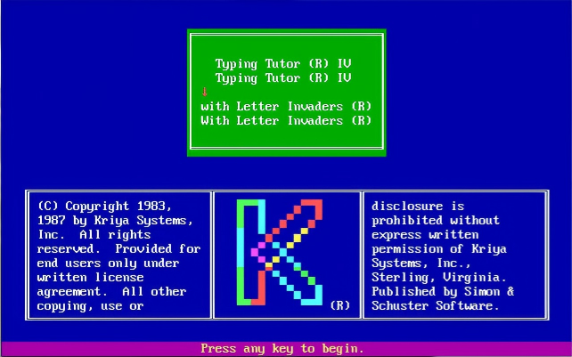
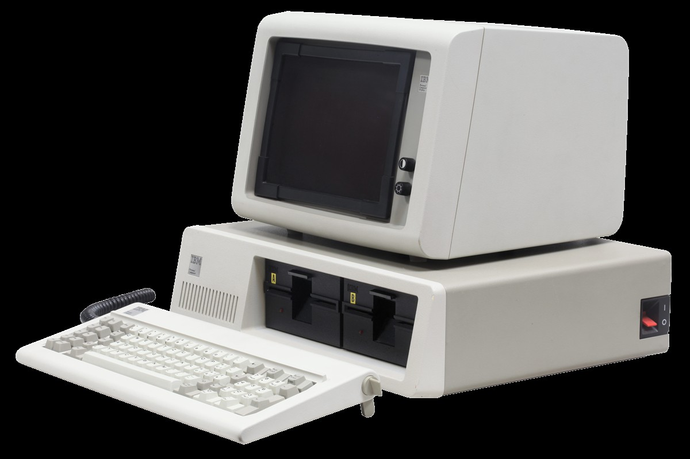

<p align="center">
  <a href="README.md"></a>&nbsp;
  <a href="README.zh-CN.md"></a>
</p>

# MS-DOS 经典收藏集 🖥️

> 保存个人计算的基础——MS-DOS 环境、工具、启动盘和历史资源。

[](LICENSE)
[]()
[]()
[]()
[]()
[]()

---

## 📋 概述

本仓库是一个精心整理的 **MS-DOS 资源合集**，包括：

- **MS-DOS 6.22** — Ghost 磁盘镜像、启动盘、安装介质（ISO + 软盘）及中文版
- **MS-DOS 7.10** — 最终版 DOS（来自 Windows 98 SE）
- **启动盘镜像** — DOS 救援盘、Windows 9x 启动盘及实用工具
- **虚拟机镜像** — 预配置的 [QEMU](ms-dos-in-qemu/README.md) 和 [VMware](ms-dos-in-vmware/README.md) 虚拟机
- **MS-DOS 6.0 源代码** — 供历史和教育参考
- **经典 Windows** — Windows 1.0 和中文 PWIN 3.2 安装盘
- **经典 DOS 游戏** — DOOM、命令与征服、超级玛丽（DOS 移植版）、推箱子、Tetrix、Nibbles 等
- **C/C++ 开发工具** — Turbo C 2.01 和 Turbo C++ 3.0
- **汇编开发工具** — MASM、TASM、NASM、LINK、DEBUG，含 Hello World 示例和一键编译脚本
- **DOS 实用工具** — ARJ、PKZIP、PC Tools、Sea 图片查看器、HD-COPY 等
- **在线演示** — 基于 js-dos (v8) 的 Typing Tutor IV 浏览器版
- **世嘉 Genesis 模拟** — Genecyst DOS 模拟器 + Road Rash ROM，在 DOSBox 内玩世嘉游戏
- **BIOS/UEFI 裸机游戏** — 超级马力欧兄弟 & 魂斗罗在 UEFI 固件上直接通过 GOP 运行

---

## 📦 仓库结构

```
msdos/
├── README.md                              # 本文件（英文版）
├── README.zh-CN.md                        # 中文翻译
├── dosbox.conf                            # 一键 DOSBox 配置文件
├── ms-dos-622.gho                         # MS-DOS 6.22 Ghost 系统镜像
├── Ghost60.exe                            # Norton Ghost 6.0（磁盘克隆工具）
│
├── ms-dos-6.22/                           # MS-DOS 6.22 安装介质
│   ├── README.md                          #   说明文档
│   ├── MS-DOS 6.22.iso                    #   完整安装 CD 镜像
│   ├── disk1.img                          #   安装盘 1
│   ├── disk2.img                          #   安装盘 2
│   ├── disk3.img                          #   安装盘 3
│   ├── Suppdisk.img                       #   补充盘
│   ├── DOS622SC.zip                       #   MSDN 简体中文安装包
│   ├── screenshot.png                     #   安装截图
│   └── install(chinese voice).mp4         #   中文语音安装视频
│
├── boot-disk/                             # 启动盘镜像合集
│   ├── README.md                          #   说明文档
│   ├── ms-dos-622.img                     #   MS-DOS 6.22 启动盘
│   ├── ms-dos-rescue.img                  #   DOS 救援盘
│   ├── win95.img                          #   Windows 95 启动盘
│   ├── win98se.img                        #   Windows 98 SE 启动盘
│   ├── hd-copy.exe                        #   HD-COPY v2.3R — 软盘复制/映像工具
│   ├── undisk.exe                         #   磁盘镜像提取工具
│   └── undiskp.exe                        #   UNDISK（保护模式）
│
├── tools/                                 # DOS 实用工具
│   ├── README.md                          #   说明文档
│   ├── ARJ.EXE                            #   ARJ v2.50 归档工具
│   ├── pkzip250.exe                       #   PKZIP v2.50 压缩工具
│   ├── pct9.zip                           #   PC Tools 9.0 工具套件
│   ├── sea13.zip                          #   Sea v1.3 图像查看器
│   ├── dskimg11.zip                       #   DSKIMG — 磁盘映像工具
│   ├── TT/                                #   Typing Tutor IV — 打字教学程序
│   └── README.md                          #   说明文档
│
├── games/                                 # 经典 DOS 游戏
│   ├── README.md                          #   说明文档
│   ├── doom.zip                           #   DOOM（1993, id Software）
│   ├── Command & Conquer.zip              #   命令与征服（1995, Westwood Studios）
│   ├── mario/                             #   超级玛丽（DOS 移植版）
│   ├── nibbles/                           #   Nibbles — 贪吃蛇（含 C 源码）
│   ├── sokoban-dos/                       #   推箱子 — 益智游戏（含源码）
│   ├── tetrix/                            #   Tetrix — 俄罗斯方块（含 ASM 源码）
│   ├── mnmym290/                          #   DOS 版扫雷
│   ├── sudoku86.zip                       #   数独游戏
│   ├── road-rash-over-genesis/            #   世嘉 Genesis 模拟（DOSBox 内运行）
│   └── start.bat                          #   游戏启动脚本
│
├── bios-uefi/                             # BIOS/UEFI 裸机游戏
│   ├── README.md                          #   说明文档
│   ├── OVMF/                              #   OVMF UEFI 固件（来自 QEMU）
│   ├── docs/                              #   技术文档（UEFI、GOP、NES）
│   ├── retro-bios/                        #   经典 BIOS ROM 收藏（QEMU 演示）
│   ├── super-mario/                       #   超级马力欧兄弟 UEFI（已编译 .efi）
│   ├── contra/                            #   魂斗罗 UEFI（仅源码，需 EDK2 编译）
│   ├── start-mario.bat                    #   启动超级马力欧
│   └── start-contra.bat                   #   启动魂斗罗（需先编译）
│
├── ms-dos-7.10/                           # MS-DOS 7.1（最终版 DOS）
│   ├── README.md                          #   说明文档
│   ├── ms-dos-71-disk1.zip                #   安装盘 1
│   ├── ms-dos-71-disk2.zip                #   安装盘 2
│   ├── ms-dos-71-boot.zip                 #   启动盘
│   └── ms-dos-71-boot-super.zip           #   增强版启动盘
│
├── ms-dos-in-qemu/                        # QEMU 1.2 中的 MS-DOS 6.22
│   ├── README.md                          #   安装指南
│   ├── myimage.zip                        #   预构建的 QEMU 磁盘镜像
│   └── qemu-screenshot.png                #   截图
│
├── ms-dos-in-vmware/                      # VMware 5.5 中的 MS-DOS 6.22
│   ├── README.md                          #   安装指南
│   └── ms-dos-vmware-5.5.zip              #   预构建的 VMware 虚拟机
│
├── ms-dos-6.0-source-code.zip             # MS-DOS 6.0 源代码（教育用途）
│
├── windows-1.x-3.x/                       # 经典 Windows 合集
│   ├── README.md                          #   说明文档
│   ├── chinese-windows-3.2-setup-disk.zip #   PWIN 3.2（中文 Windows 3.2）
│   └── windows-1.0-setup-disk.zip         #   Windows 1.0（1985）
│
├── web-demo/                              # 在线 DOS 演示（js-dos v8）
│   ├── README.md                          #   说明文档
│   ├── index.html                         #   Typing Tutor IV 浏览器版
│   ├── tt-bundle.zip                      #   DOS 文件包（TT + 帮助 + 历史）
│   ├── AUTOEXEC.BAT                       #   自动启动脚本
│   ├── TT.EXE                             #   Typing Tutor IV 程序
│   ├── TT.HLP                             #   帮助文件
│   └── TT.HIS                             #   成绩记录
│
├── UCDOS-7.0-WPS-CCED-6.0-setup.iso      # UCDOS 7.0（含 WPS）+ CCED 6.0
│
├── turbo-c-and-c++/                       # C/C++ 开发工具
│   ├── README.md                          #   说明文档
│   ├── Turbo C 2.01 (5.25-360k).zip       #   Turbo C 2.01 — 合并自 6 张软盘镜像
│   ├── Turbo C++ 3.0.zip                  #   Turbo C++ 3.0 — 完整包
│   ├── TC2.zip                            #   Turbo C 2.0 备用包
│   ├── TC3.zip                            #   Turbo C++ 3.0 备用包
│   ├── TC2.0 Install Screenshot/          #   安装截图
│   └── TC++3.0 Install Screenshot/        #   安装截图
│
├── assembly/                              # 汇编开发工具
│   ├── README.md                          #   说明文档
│   ├── MASM.EXE                           #   Microsoft Macro Assembler
│   ├── LINK.EXE                           #   Microsoft Linker
│   ├── debug.exe                          #   MS-DOS DEBUG 调试器
│   ├── masm611.zip                        #   MASM 6.11 完整包
│   ├── tasm31.zip                         #   Turbo Assembler v3.1
│   ├── nasm098p.zip                       #   NASM v0.98p
│   ├── hello.asm                          #   Hello World 汇编示例
│   └── run.bat                            #   一键 DOSBox 编译运行脚本
│
└── others/                                # 其他实用工具
    ├── README.md                          #   说明文档
    ├── UltraISO-9.7.6.3860-CN.zip         #   UltraISO 磁盘映像编辑器
    └── WinImage11-cn.zip                  #   WinImage 磁盘映像工具
```

---

## 🚀 快速开始

### 方式一：DOSBox（跨平台，推荐）🎯

**一键启动** — 安装 [DOSBox](https://www.dosbox.com/) 后，运行：

```bash
dosbox -conf dosbox.conf
```

这会自动挂载仓库目录、设置 PATH、配置内存（EMS/XMS）、声卡（Sound Blaster 16）和 VGA（SVGA S3），以获得最佳复古体验。

**在 DOSBox 内**，你从仓库根目录 `C:\` 开始：

```dos
C:\> dir              → 列出当前目录文件
C:\> cd tools\TT      → 进入 Typing Tutor IV 目录
C:\TOOLS\TT> TT       → 启动打字教学程序
C:\> cd games         → 浏览经典 DOS 游戏
C:\> cd assembly      → 汇编开发工具
```

随时输入 `EXIT` 退出 DOSBox。

> 
> *Typing Tutor IV — 本合集收录的经典 DOS 打字教学程序。*

> **▶️ [在浏览器中尝试](https://weibifan.github.io/msdos/web-demo/)** — 通过 [js-dos](https://js-dos.com/) 在线运行 Typing Tutor IV。

---

### 方式二：QEMU（轻量）

```bash
cd ms-dos-in-qemu
unzip myimage.zip
qemu-system-x86_64 -m 64 -drive file=myimage.img,format=raw
```

详见 [QEMU 指南](ms-dos-in-qemu/README.md)。

### 方式三：VMware Workstation

1. 解压 `ms-dos-in-vmware/ms-dos-vmware-5.5.zip`
2. 用 **VMware Workstation 5.x** 或更高版本打开 `.vmx` 文件
3. 开机

### 方式四：物理机 / 真实硬件

使用启动盘镜像和软驱：

```bash
hd-copy.exe boot-disk/ms-dos-622.img
```

或用 Norton Ghost 部署 Ghost 镜像 `ms-dos-622.gho`。

---

## 📚 内容详情

### MS-DOS 6.22（1994）

最后一个独立的零售版 MS-DOS。提供：
- **Ghost 镜像**（`ms-dos-622.gho`）— 可直接部署的系统镜像
- **启动盘**（`boot-disk/ms-dos-622.img`）— 1.44 MB 软盘镜像
- **安装介质**（`ms-dos-6.22/`）— ISO、3 张安装软盘、补充盘，以及简体中文版（`DOS622SC.zip`）
- **安装视频** — 中文语音解说，嵌入在 [ms-dos-6.22 README](ms-dos-6.22/README.md) 中

### MS-DOS 7.10（1998）

最终版 DOS，随 Windows 98 SE 发布。引入了 FAT32 和大磁盘支持。包含三张安装软盘镜像。

### 虚拟机镜像

| 平台 | 镜像 | 说明 |
|----------|-------|-------------|
| **QEMU 1.2** | `ms-dos-in-qemu/` | 轻量模拟，64 MB 内存，200 MB 磁盘 |
| **VMware 5.5** | `ms-dos-in-vmware/` | 预配置 VM，支持 VGA、软驱 |

### 经典 Windows 与中文 DOS 软件

| 文件 | 说明 |
|------|-------------|
| `windows-1.x-3.x/` | **经典 Windows 合集** — 详见 [README](windows-1.x-3.x/README.md) |
| `&nbsp;&nbsp;├── windows-1.0-setup-disk.zip` | Microsoft Windows 1.0（1985）— 首个图形界面 OS |
| `&nbsp;&nbsp;├── chinese-windows-3.2-setup-disk.zip` | PWIN 3.2 — 中文版 Windows 3.2 |
| `UCDOS-7.0-WPS-CCED-6.0-setup.iso` | **UCDOS 7.0**（含 WPS 文字处理）+ **CCED 6.0**（中文表格编辑）— 90 年代必备中文 DOS 软件 |

### 经典 DOS 游戏

| 游戏 | 说明 |
|------|-------------|
| `doom.zip` | **DOOM**（1993）— id Software 的传奇第一人称射击游戏 |
| `Command & Conquer.zip` | **命令与征服**（1995）— Westwood Studios 的即时战略经典 |
| `mario/` | **超级玛丽（DOS 移植版）** |
| `nibbles/` | **Nibbles** — 贪吃蛇游戏，附 **C 源码** |
| `tetrix/` | **Tetrix** — 俄罗斯方块克隆，附 **x86 汇编源码**（`tetrix.asm`） |
| `sokoban-dos/` | **推箱子** — 益智游戏，附完整 **Turbo C 源码**和编译脚本 |
| `mnmym290/` | **扫雷** for DOS |
| `sudoku86.zip` | **数独** 益智游戏 for DOS |

### C/C++ 开发工具

| 文件 | 说明 |
|------|-------------|
| `turbo-c-and-c++/Turbo C 2.01 (5.25-360k).zip` | Turbo C 2.01 — 6 张 360 KB 软盘镜像 |
| `turbo-c-and-c++/Turbo C++ 3.0.zip` | 完整 Turbo C++ 3.0 包 |
| `turbo-c-and-c++/TC2.zip` | Turbo C 2.0 备用包 |
| `turbo-c-and-c++/TC3.zip` | Turbo C++ 3.0 备用包 |

### 汇编开发工具

| 工具 | 说明 |
|------|-------------|
| `assembly/MASM.EXE` | Microsoft Macro Assembler |
| `assembly/LINK.EXE` | Microsoft Linker |
| `assembly/debug.exe` | MS-DOS DEBUG 调试器 |
| `assembly/masm611.zip` | MASM 6.11 完整包 |
| `assembly/tasm31.zip` | Turbo Assembler v3.1 |
| `assembly/nasm098p.zip` | NASM v0.98p |
| `assembly/hello.asm` | Hello World 汇编示例（含详细中文注释） |
| `assembly/run.bat` | 一键 DOSBox 编译运行脚本（`run.bat hello`） |

### 世嘉 Genesis 模拟

在 DOSBox 内使用 Genecyst（原生 DOS 模拟器）运行 Genesis 游戏。

| 目录 | 说明 |
|-----------|-------------|
| `games/road-rash-over-genesis/genecyst/` | Genecyst DOS 模拟器（Bloodlust Software） |
| `games/road-rash-over-genesis/roms/roadrash.bin` | Road Rash（1991, Electronic Arts）美版 ROM |
| `games/road-rash-over-genesis/run.bat` | DOSBox 一键启动脚本 |

控制方法和详细说明请见 [Sega Genesis README](games/road-rash-over-genesis/README.md)。

### 其他实用工具

| 文件 | 说明 |
|------|-------------|
| `others/UltraISO-9.7.6.3860-CN.zip` | UltraISO v9.7.6（中文版）— CD/DVD 映像编辑制作工具 |
| `others/WinImage11-cn.zip` | WinImage v11（中文版）— 软盘和硬盘映像工具 |

### 原始源代码

`ms-dos-6.0-source-code.zip` 包含 MS-DOS 6.0 的汇编源代码，由微软发布，仅供教育和历史参考。

---

## 🛠 启动盘工具

| 工具 | 说明 |
|------|-------------|
| **Ghost60.exe** | Norton Ghost 6.0 — 系统磁盘映像与克隆 |
| **hd-copy.exe** | HD-COPY v2.3R — 快速软盘复制/映像工具（Oliver Fromme, Cardware） |
| **undisk.exe** | 提取/捕获磁盘镜像文件 |
| **undiskp.exe** | UNDISK 保护模式变体 |

---

## 🖥️ 经典 1996 年 PC 配置

90 年代中期典型的高端 PC，可运行 MS-DOS 6.22、Windows 3.2 和早期 Windows 9x：

| 组件 | 规格 |
|-----------|---------------|
| **CPU** | Intel 80486 DX2 — 66 MHz |
| **内存** | 8 MB |
| **存储** | 512 MB HDD |
| **显卡** | S3 Graphics Adapter，1 MB VRAM（Windows 3.2 下 640×480 高彩色） |
| **软驱** | 3.5 英寸软驱 × 1 |
| **光驱** | 2× 或 4× CD-ROM 驱动器 |
| **声卡** | Sound Blaster 16 |
| **鼠标** | Microsoft 兼容串口鼠标 |
| **网络** | NE2000 兼容（后期添加） |

> 
> *IBM PC — 定义了 MS-DOS 时代的标志性硬件。*

---

## ⚠️ 系统要求（MS-DOS 6.22）

| 组件 | 最低 | 推荐 |
|-----------|---------|-------------|
| CPU | 8088 | 486 DX 或更高 |
| 内存 | 640 KB | 4–16 MB |
| 存储 | 10 MB | 200 MB |
| 软驱 | 1.44 MB 驱动器 | — |
| 显卡 | CGA | VGA |
| 启动介质 | 软盘或硬盘 | 带 DOS 的硬盘 |

---

## 📖 参考链接

- [MS-DOS 历史](https://en.wikipedia.org/wiki/MS-DOS)
- [MS-DOS 6.22 技术参考](https://archive.org/details/msdos622)
- [DOSBox](https://www.dosbox.com/) — 在现代系统上运行 DOS 应用的模拟器
- [DOS资源站 CN-DOS.net](https://www.cn-dos.net/) — 中文 DOS 社区与资源存档
- [老操作系统集锦](http://www.regexlab.com/sswater/zh/oldos.htm) — 复古 OS 合集
- [QEMU 文档](https://www.qemu.org/documentation/)
- [FreeDOS](https://www.freedos.org/) — 现代免费 DOS 替代品

---

## 🤝 贡献指南

欢迎贡献！如果你有其他 MS-DOS 资源、工具或文档：

1. Fork 本仓库
2. 创建功能分支
3. 提交 Pull Request

> **注意**：原始 MS-DOS 组件归各自所有者所有。本合集仅供 **教育和存档用途**。

---

<p align="center">
  <sub>保存计算历史，一次一个字节。🖥️</sub>
</p>
