<p align="center">
  <a href="README.md"></a>&nbsp;
  <a href="README.zh-CN.md"></a>
</p>

# DOS 网络配置 — Microsoft Network Client 3.0

> 原文：[kompx.com](http://www.kompx.com/en/network-setup-in-dos-microsoft-network-client.htm)

要在 DOS 中安装 Microsoft Network Client 3.0 并配置网络，需要以下软件：

1. **Microsoft Network Client 3.0** — [`msnc3.0.rar`](msnc3.0.rar)
2. **NDIS 2.0 驱动** — 对应以太网卡（如 Realtek RTL8029AS）— [`ndis2-8029as.rar`](ndis2-8029as.rar)
3. **QEMM97**（若未使用 MS-DOS 6.0+）— [`qemm97.rar`](qemm97.rar)

---

## 安装步骤

### 1. 准备驱动目录

创建文件夹（如 `C:\DRIVERS\`），将 NDIS 2.0 驱动放入其中。

### 2. 准备安装软盘

解压 Microsoft Network Client 3.0 磁盘映像：

```
DSK3-1.EXE -d A:
DSK3-2.EXE -d A:
```

### 3. 安装 Microsoft Network Client 3.0

从第一张软盘运行 `setup.exe`，按向导操作：

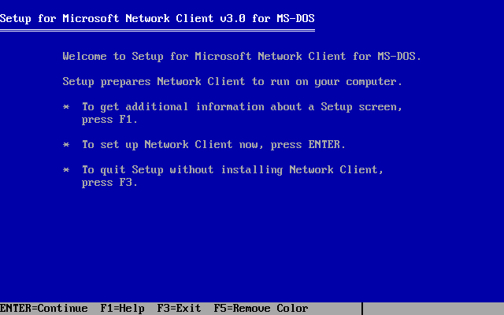

1. **欢迎** — 回车继续

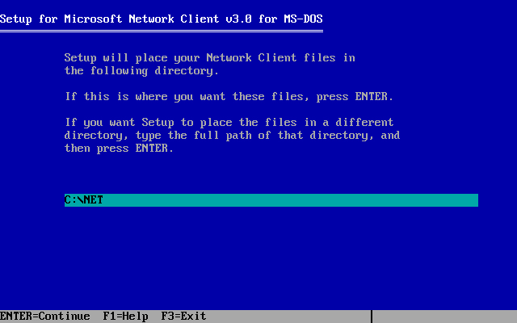

2. **安装路径** — 选择目录（默认 `C:\NET` 即可）

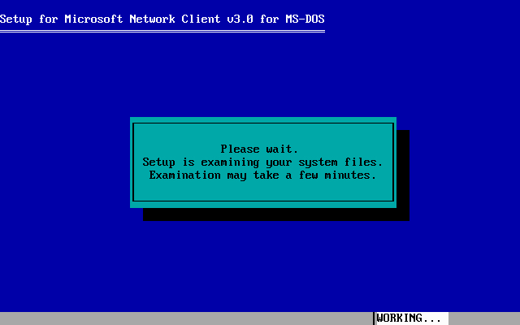

3. **驱动选择** — 如未列出网卡，选 "*Network adapter not shown on list below..."

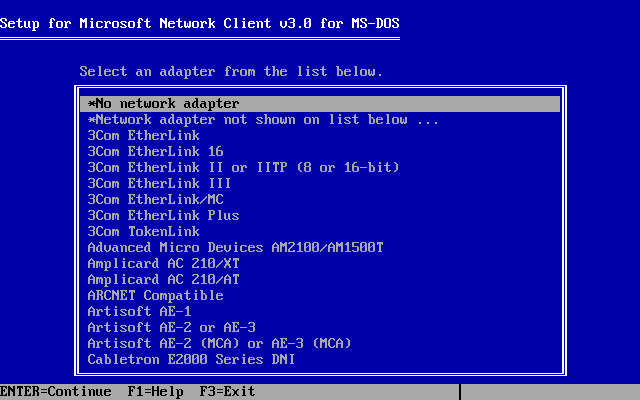

4. **驱动路径** — 输入 `C:\DRIVERS\`

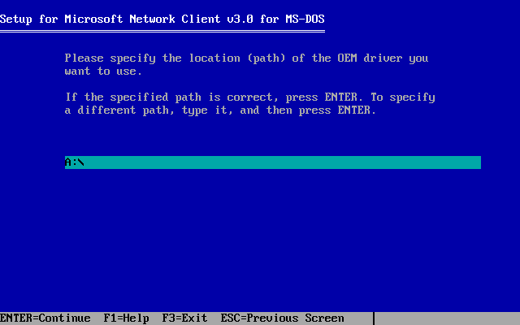

5. **选择驱动** — 从列表选网卡（如 `RTL8029AS PCI Ethernet Adapter`）

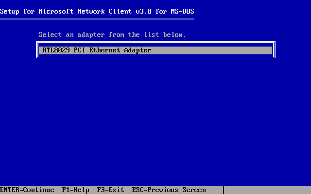

6. **性能** — 选择是否让 MSCLIENT 用更多内存提升性能

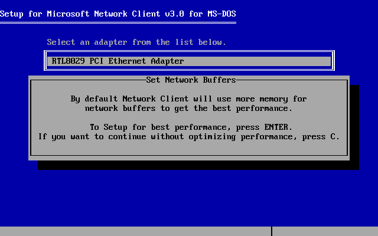

7. **用户名** — 输入最多 20 个字符（如 `net`）

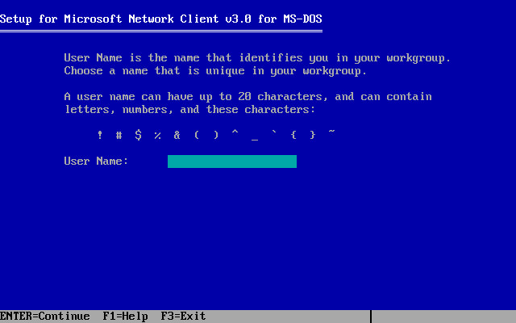

8. **确认** — 核对设置，确认后复制文件到 `C:\NET\`

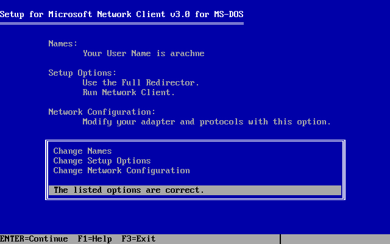

9. 正在复制文件

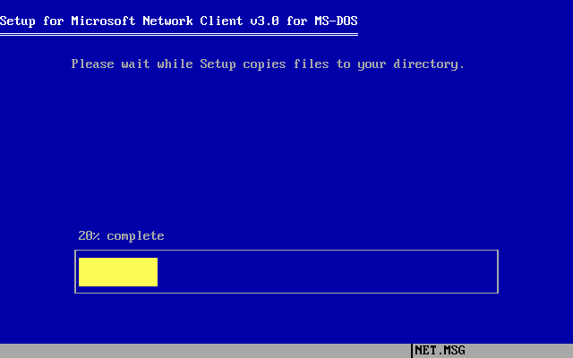

10. 安装完成 — 回车重启

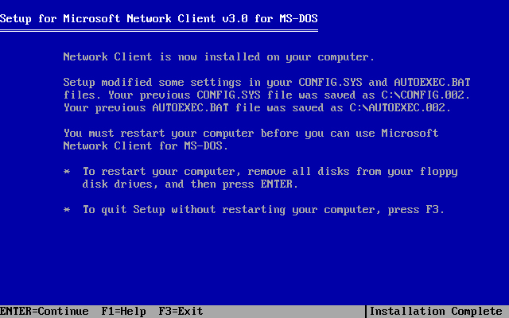

11. 回车重启

### 4. 首次启动

重启后提示：
- **用户名** — 回车使用安装时设定的名称
- **密码** — 回车（未设密码）
- **创建密码？** — 回车跳过

### 5. 优化基本内存

运行 `MemMaker`（MS-DOS）或 `OPTIMIZE`（QEMM97）优化常规内存。各提示均回车即可，计算机将自动重启数次。

---

## 网络连接

配置完成后，每次启动时 Microsoft Network Client 会自动建立网络连接。

---

## 系统要求

- MS-DOS 6.0+
- FreeDOS 1.0+
- 以太网卡（需 NDIS 2.0 驱动）

---

## 目录内容

| 文件 | 说明 |
|------|------|
| `msnc3.0.rar` | Microsoft Network Client 3.0 安装软盘 |
| `ndis2-8029as.rar` | Realtek RTL8029AS PCI 以太网卡 NDIS 2.0 驱动 |
| `qemm97.rar` | QEMM97 内存管理器（用于非 MS-DOS 6.0+ 系统） |

---

## 参考链接

- [原文 - kompx.com](http://www.kompx.com/en/network-setup-in-dos-microsoft-network-client.htm)
- [Arachne 浏览器 — 以太网安装设置](http://www.kompx.com/en/arachne-installing-and-setting-up-ethernet.htm)
- [DOS 下的 FTP](http://www.kompx.com/en/ftp-in-dos.htm)
